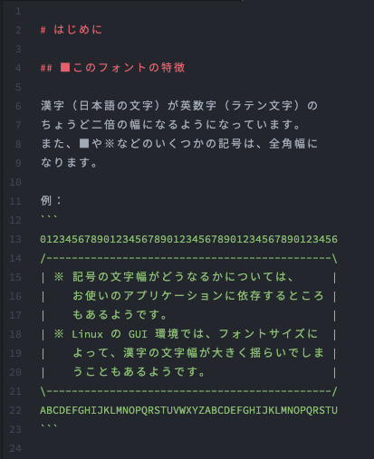

[Read me in English](./README.md)

# Relaxed Typing Mono
Relaxed Typing Mono は、Source Code Pro と Noto Sans JP の派生フォントです。英数字は Source Code Pro から、漢字は Noto Sans JP をもとにしています。

このフォントでは、漢字は英数字のちょうど 2 倍の幅になっています。また、「■」など、ときどき半角文字のように扱われる記号も全角になっています。

## 表示例

## 生成の仕方
1. Source Code Pro と Noto Sans JP をダウンロードしてください
2. それらを `resources` ディレクトリに入れます
3. `script.py` を実行します（`fontforge` Python ライブラリが必要です）
