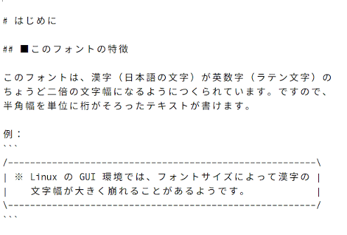
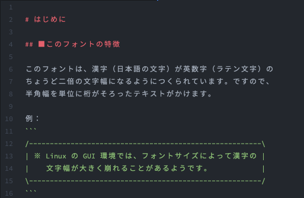

[Read me in English](./README.md)

# このフォントについて
Relaxed Typing Mono JP は、Source Code Pro と Noto Sans JP の派生フォントファミリーです。英数字は Source Code Pro、漢字は Noto Sans JP をもとにしています。

このフォントは、漢字（などの全角文字）が英数字（などの半角文字）のちょうど 2 倍の幅になるようにつくられています。また、「■」など、ときどき半角文字として扱われる記号も全角幅でつくられています。

## ダウンロード
フォントは[こちら](https://github.com/mshioda/relaxed-typing-mono-jp/releases/)からダウンロードできます。

## 表示例
#### Windows 上のメモ帳の場合

#### macOS 上の Atom の場合

## 生成の仕方
1. Source Code Pro（TTF）と Noto Sans JP（OTF）をダウンロードしてください
2. それらを `resources` ディレクトリに入れます
3. `conv-ttf.sh` を実行します（`otf2ttf` が必要です）
4. `script.py` を実行します（`fontforge` Python ライブラリが必要です）
